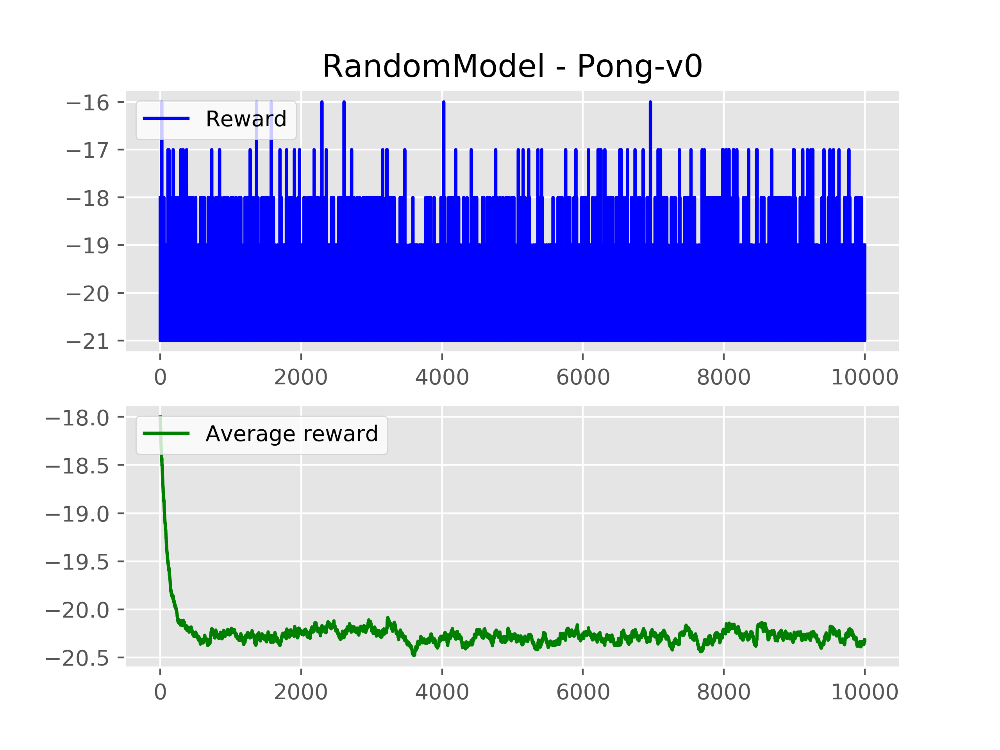

# ml-games

---

_Project, created to run reinforcement learning experiments in **gym** environments. 
The idea is to create universal framework, that could be used to run the games as 
well as comfortably test and compare different RL algorithms. Currently works with **Atari** 
envs from gym and uses raw pixels input to predict discrete actions as an output._


## Setup

### _Windows:_

Download and install [Anaconda](https://www.anaconda.com/distribution/). Run:

```
conda create -n ml-games python=3.6 anaconda 
conda activate ml-games 
pip install -U numpy
pip install tensorflow
pip install gym
pip install --no-index -f https://github.com/Kojoley/atari-py/releases atari_py
```


### _Linux:_

Download and install [Anaconda](https://www.anaconda.com/distribution/). Run:

```
sudo apt install -y python3-dev zlib1g-dev libjpeg-dev cmake swig python-pyglet python3-opengl libboost-all-dev libsdl2-dev libosmesa6-dev patchelf ffmpeg xvfb
conda create -n ml-games python=3.6 anaconda 
source activate ml-games 
pip install -U numpy
pip install tensorflow
pip install 'gym[atari]'
```

## Usage

Clone the project and activate conda env:
```
git clone https://github.com/km1414/ml-games.git
conda activate ml-games 
cd ml-games
```
Run selected [game](https://gym.openai.com/envs/#atari), model and number of games. Examples:

```
python main.py -game Breakout-v0 -model RandomModel
python main.py -game Pong-v0 -model PolicyGradientsModel -n_games 20000
```

Game statistics and recordings will be saved in **images/** and **videos/**.


## Repo overview


**gamer.py (Gamer)** - runs the games, tracks statistics and gets action from model. At the selected frequency plots game statistics 
to **_images/_** and saves game game play recordings to **_videos/_** .

**models/random_model.py (RandomModel)** - baseline model, that always makes random moves. Created to test if everything works and contains 
only mandatory methods:
- **predict_action(observation)**  - get the current game state from Gamer and return predicted action.
- **get_step_results(observation, reward, done, info)** - get the results after the action step was done.

**models/policy_gradients_model.py (PolicyGradientsModel)** - RL model, that predicts best action from existing observation and learns from his experience. 
Based on simple neural network and Policy Gradients approach. Contains same methods as RandomModel and many more. 

**main.py** Extracts command line arguments, loads initializes objects
and runs the projects according to user preferences.

## Results

**PolicyGradientsModel** - Random moves vs. model after 10k games:




## Contribution
New models could be created and added to **/models**. They should contain same methods as 
RandomModel and in order to run they should be added to **main.py**.


